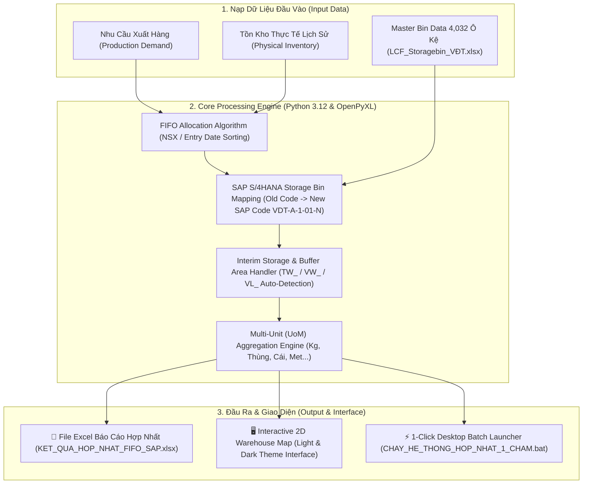

<div align="center">

# 🏭 ENTERPRISE SUPPLY CHAIN & WAREHOUSE COMMAND CENTER
### **Hệ Thống Quản Lý Kho Động SAP S/4HANA & Tự Động Hóa Phân Bổ FIFO**

[](https://levutuong01694242789-sketch.github.io/hub-quan-ly-kho/)
[](https://www.python.org/)
[](https://opensource.org/licenses/MIT)
[](https://levutuong01694242789-sketch.github.io/hub-quan-ly-kho/)

🌐 **TRUY CẬP HỆ THỐNG TRỰC TUYẾN (GITHUB PAGES)**  
👉 **[https://levutuong01694242789-sketch.github.io/hub-quan-ly-kho/](https://levutuong01694242789-sketch.github.io/hub-quan-ly-kho/)**

---
</div>

## 📌 GIỚI THIỆU DỰ ÁN (PROJECT OVERVIEW)

**Enterprise Supply Chain & Warehouse Command Center** là giải pháp phần mềm quản lý kho vận toàn diện được thiết kế chuẩn hóa theo kiến trúc **SAP S/4HANA EWM (Extended Warehouse Management)**.

Hệ thống giải quyết triệt để 3 bài toán lõi trong logistics nhà máy & kho hàng công nghiệp:
1. **Tự Động Hóa Xuất Kho FIFO (First-In, First-Out)**: Ghép nối nhu cầu sản xuất với tồn kho thực tế, ưu tiên nhặt hàng theo Hạn sử dụng (NSX) hoặc Ngày nhập cũ nhất.
2. **Quản Lý Kho Động 4,032 Vị Trí Kệ & Vùng Đệm Sàn**: Trực quan hóa ma trận 2D chuẩn vị trí kệ cao tầng (`VDT-A-1-01-N`...) và các vùng đệm sàn trung chuyển (`TW_SX1-1`, `VL_PA_001_CD-1`...).
3. **Thống Kê Tồn Kho Đa Đơn Vị Tính (Multi-Unit Breakdown)**: Bóc tách minh bạch và độc lập 9 nhóm đơn vị tính (`Kg`, `Thùng`, `Cái`, `Cuộn`, `Met`, `Bộ`, `Đôi`, `Chai`, `Vắt`) mà không bị gộp chung hay sai lệch toán học.

---

## 🚀 DANH MỤC CÁC PHÂN HỆ ỨNG DỤNG (SYSTEM MODULES)

| STT | Phân Hệ Ứng Dụng | Mô Tả Chức Năng | Trạng Thái Vận Hành | Trực Tuyến / Mã Nguồn |
| :---: | :--- | :--- | :---: | :---: |
| 🌟 **01** | **Hệ Thống Hợp Nhất 1-Chạm All-in-One** | Kết nối tự động 2 luồng: Phân bổ FIFO ➔ Map 4,032 vị trí SAP & Vùng đệm ➔ Ma trận 2D ➔ Xuất Excel. |  | [👉 Mở Web App](https://levutuong01694242789-sketch.github.io/hub-quan-ly-kho/he_thong_hop_nhat_fifo_sap/index.html) |
| 🏢 **02** | **Kho Động SAP S/4HANA & Visual Matrix 2D** | Sơ đồ 2D trực quan 4,032 ô kệ A-H + 6 Vùng đệm sàn. Chế độ màu Sáng/Tối linh hoạt. |  | [👉 Mở Ma Trận 2D](https://levutuong01694242789-sketch.github.io/hub-quan-ly-kho/wms_vdt_sap4hana/index.html) |
| 📦 **03** | **Engine Phân Bổ & Trừ Tồn Kho FIFO** | Engine Python chuyên trách phân bổ nhặt hàng FIFO theo lô/hạn dùng và xuất báo cáo phiếu xuất kho. |  | [👉 Xem Code](https://github.com/levutuong01694242789-sketch/hub-quan-ly-kho/tree/main/quan_ly_kho_fifo) |
| 📊 **04** | **Định Mức Trữ Kho 3 Ngày & Đơn PO** | Tính điểm ROP, định mức trữ kho 3 ngày và tự động tạo file đơn mua hàng PO Excel. |  | [👉 Mở App PO](https://levutuong01694242789-sketch.github.io/hub-quan-ly-kho/mo_app_tru_kho.html) |
| 💻 **05** | **Quản Lý Tài Sản IT & Mã QR Công Ty** | Quản lý cấp phát tài sản IT (Laptop, Máy in, Camera), quét mã QR Camera & tạo tem in nhãn. |  | [👉 Mở App IT](https://levutuong01694242789-sketch.github.io/hub-quan-ly-kho/it_asset.html) |

---

## 🏗️ SƠ ĐỒ KIẾN TRÚC LUỒNG DỮ LIỆU (SYSTEM ARCHITECTURE)



---

## ⚙️ TÍNH NĂNG KỸ THUẬT NỔI BẬT (TECHNICAL HIGHLIGHTS)

### 1. Phân Loại Vị Trí Kho Thông Minh (Double-Deep Racks vs Buffer Floor Bins)
- **🏢 Kệ Cao Tầng Cố Định (Dãy A đến H)**: Quản lý chính xác 4,032 vị trí kệ cao tầng chuẩn SAP S/4HANA (`VDT-A-1-01-N`...). Tính % lấp đầy, số ô kệ trống và có hàng chính xác.
- **🔄 Vùng Đệm & Trung Chuyển Sàn (Buffer / Staging Bins)**: Tự động phát hiện và quản lý riêng các vùng đệm trung chuyển (`TW_SX1-1` - Đệm sản xuất, `VL_PA_001_CD-1` - Đệm bao bì, `VL_RM_001_CD-1` - Đệm nhận nguyên liệu). Không làm biến dạng chỉ số ô trống trên kệ.

### 2. Xử Lý Tồn Kho Đa Đơn Vị Tính (Dynamic Multi-Unit Aggregation)
- Không gộp dồn hoặc cưỡng ép chuyển đổi khác đơn vị tính.
- Tự động thống kê minh bạch theo từng đơn vị gốc: `20,738.5 Kg`, `2,090,516.8 Cái`, `40,362.5 Thùng`, `2,095.7 Cuộn`...

### 3. Thiết Kế Giao Diện Đa Chế Độ (Multi-Theme System Design)
- ☀️ **Light Mode (Chế Độ Sáng Công Sở)**: Phù hợp môi trường văn phòng, trực quan, màu Navy Blue & Trắng tinh tế.
- 🌙 **Dark Mode (Chế Độ Tối Cyberpunk)**: Phù hợp quan sát ban đêm hoặc thiết bị di động nhà xưởng, giảm mỏi mắt.

---

## 📂 CẤU TRÚC THƯ MỤC REPOSITORY (DIRECTORY HIERARCHY)

```
hub-quan-ly-kho/
├── index.html                           # Central Portal Landing Page
├── README.md                            # Professional Master Documentation
├── .gitignore                           # Repository Ignored Rules
│
├── he_thong_hop_nhat_fifo_sap/          # 🌟 Module 1: Unified All-in-One System
│   ├── CHAY_HE_THONG_HOP_NHAT_1_CHAM.bat# 1-Click Desktop Launcher
│   ├── unified_engine.py                # Core Unified Processing Engine
│   ├── index.html                       # 2D Interactive Matrix Dashboard
│   ├── styles.css                       # Multi-Theme Design Tokens
│   ├── app.js                           # Real-time Filter & Search Logic
│   ├── data.js / wms_data.json          # Embedded Offline Data
│   └── HDSD_NHAN_VIEN_KHO.md            # User Manual
│
├── wms_vdt_sap4hana/                    # 🏢 Module 2: SAP Dynamic Warehouse Matrix
│   ├── MO_HE_THONG_KHO_VDT.bat          # 1-Click Launcher
│   ├── wms_engine.py                    # Bin Mapping Engine
│   ├── index.html / app.js / styles.css # 2D Matrix UI
│   └── HDSD_NHAN_VIEN_KHO.md            # User Manual
│
├── quan_ly_kho_fifo/                    # 📦 Module 3: FIFO Stock Deduction Engine
│   ├── CHAY_FIFO_1_CHAM.bat             # 1-Click Launcher
│   ├── CHUAN_BI_DU_LIEU.xlsx            # Sample Input Template
│   └── scripts/process_fifo_qr.py       # FIFO Engine Script
│
├── mo_app_tru_kho.html                  # 📊 Module 4: 3-Day Buffer Stock & PO App
└── it_asset.html                        # 💻 Module 5: IT Asset & QR Manager App
```

---

## 🖥️ HƯỚNG DẪN VẬN HÀNH DÀNH CHO NHÂN VIÊN KHO (QUICK START)

### Phương Án 1: Chạy Trực Tiếp Trên Máy Tính (Nhanh Nhất)
1. Tải hoặc Mở thư mục dự án tại máy tính.
2. Nhấp đúp chuột vào file:
   **`CHAY_HE_THONG_HOP_NHAT_1_CHAM.bat`** (nằm trong thư mục `he_thong_hop_nhat_fifo_sap`).
3. Hệ thống sẽ tự động thực thi phân bổ FIFO, map vị trí SAP và mở giao diện sơ đồ kho 2D trên trình duyệt.

### Phương Án 2: Sử Dụng Trực Tuyến Qua Trình Duyệt Web
1. Truy cập trang chủ Hub: **[https://levutuong01694242789-sketch.github.io/hub-quan-ly-kho/](https://levutuong01694242789-sketch.github.io/hub-quan-ly-kho/)**
2. Nhấp chọn ứng dụng muốn làm việc:
   - Thao tác hợp nhất: Bấm **"Mở Web App Hợp Nhất"**.
   - Xem sơ đồ kho: Bấm **"Chạy 2D Map"**.
3. Chọn file dữ liệu Excel và thực hiện thao tác 3-bước đơn giản trên màn hình.

---

## 👨‍💻 TÁC GIẢ & THÔNG TIN BẢO HÀNH (AUTHOR & CREDITS)

- **Chủ Quản Dự Án**: **Lê Vũ Tường** (Supply Chain & Logistics Specialist)
- **Công Nghệ Phát Triển**: Antigravity AI Engine (Advanced Agentic Systems)
- **Phiên Bản**: `v2.5.0-Enterprise` (Cập nhật 2026)

---
<div align="center">
  <i>© 2026 Le Vu Tuong - Enterprise Supply Chain & Warehouse Command Center. All rights reserved.</i>
</div>
